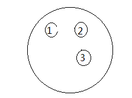
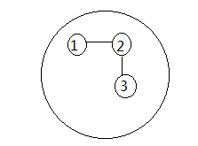
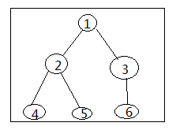
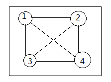
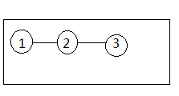
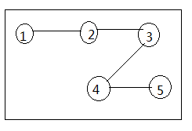

# 基础知识

基本概念

## 数据结构的定义与分类

数据结构就是关系,是数据元素之间存在的一种或者多种特定关系的集合

数据结构分为两类：a.逻辑结构 b.物理结构

逻辑结构：数据对象中数据元素之间的相互关系。

物理结构：数据的逻辑结构在计算机中的存储形式。

### 逻辑结构

逻辑结构分为以下四类: 

#### 1. 集合结构:

结构中的数据元素之间除“同属于一个集合”外,没有别的不三不四的关系

#### 2.线性结构

线性结构中的元素是一对一的关系

#### 3.树形结构

树形结构的元素存在一种一对多的层次关系

#### 4.图形结构

 图形结构的元素存在着对多对的关系

### 物理结构

​        物理结构又称存储结构，是指数据结构在计算机中的表示（又称映像）

​        我们根据物理结构的定义,我们研究的是如何把数据存储到计算机存储器中。存储器针对内存而言,像硬盘,软盘,光盘等外部存储器的数据组织通常用文件结构描述。

​         存储结构主要有顺序存储、链式存储、索引存储和散列存储

#### 1.顺序存储结构: 

数据元素放在地址连续的存储单元中,其数据之间的逻辑关系和物理关系是一致的。(数组就是顺序存储结构) 

#### 2.链式结构: 

通过实例了解链式结构: 现在如银行,医院都设置了排队系统。每个人去了都会领到1个号,等着叫号。叫你的时候你可以去办理业务。等待的时候,你可以去任何地方,只要叫到你的时候，你来就可以了。你这里关注的是你前面的那个号码。链式结构就是这样的,比顺序结构灵活。 
链式存储结构: 将数据存放在任意的存储单元,这组存储单元可以是连续的,也可以是不连续的。链式存储结构的数据元素,存储结构不能反映其逻辑关系。可以使用指针来保存数据元素的地址,通过地址找到数据元素的位置。 

