# 1. 树的度
## 1. 节点的度（单个节点）
**定义**：某个节点**拥有的子节点个数**
- 叶子节点（终端节点）：没有孩子 → **度 = 0**
- 只有1个孩子 → 度=1
- 有3个孩子 → 度=3

举例：
A 下面挂了 B、C、D
👉 节点A 的度 = **3**

---

## 2. 树的度（整棵树）
**定义**：整棵树里，**所有节点的度 的最大值**

举例：
树里所有节点度数分别是：`0,1,2,3,0,2`
最大值是 3
👉 **这棵树的度 = 3**

---

## 3. 超级好记口诀
- **节点的度**：自己有几个娃
- **树的度**：全家娃最多的那个数量

---

## 4. 常考补充（软设选择题）
1. 二叉树：
   规定**每个节点最多2个子节点**
   → 所以**二叉树的度 ≤ 2**
2. 叶子节点：度一定是 0
3. 孤立根节点（没孩子）：根节点度=0，树的度=0

---

## 5.小例题巩固
一棵树：
- 节点①：2个孩子
- 节点②：0个孩子
- 节点③：4个孩子
- 节点④：1个孩子

各节点度：2、0、4、1
👉 树的度 = **4**

### 核心公式
树通用公式：
n_0 = n_2 + 2n_3 + 3n_4 + ... + (k-1)n_k + 1

- \(n_0\)：叶子节点（度为0）
- \(n_1\)：度为1节点
- \(n_2\)：度为2节点
- \(n_3\)：度为3节点
- \(n_4\)：度为4节点

---
### 代入题目数据
已知：
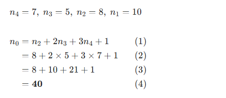

---
### 补充原理（方便理解）
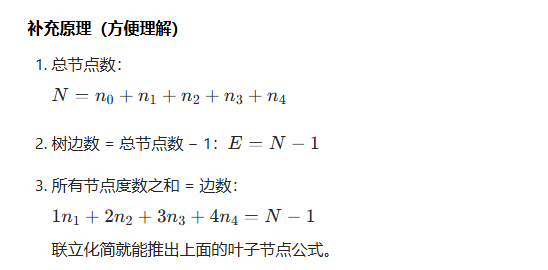

**答案：叶子节点有 40 个**

# 2.二叉树顺序存储
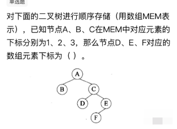
**二叉树顺序存储的下标规则**，直接套用公式就能秒解。

---
## 一、核心公式（必背）
顺序存储（数组下标从1开始）时：
- 若父节点下标为 `i`
- 则**左孩子下标 = 2i**
- 则**右孩子下标 = 2i + 1**

---
## 二、按图推导下标
1.  **已知条件**
   - A：下标1
   - B：下标2（A的左孩子）
   - C：下标3（A的右孩子）

2.  **计算D的下标**
    D是C的左孩子：
    \[
    D = 2 \times C = 2 \times 3 = 6
    \]

3.  **计算E的下标**
    E是C的右孩子：
    \[
    E = 2 \times C + 1 = 2 \times 3 + 1 = 7
    \]

4.  **计算F的下标**
    F是E的左孩子：
    \[
    F = 2 \times E = 2 \times 7 = 14
    \]

---
## 三、最终结果
D、E、F的下标分别为：**6、7、14**，对应选项 **D**。

✅ 答案：**D**

---
💡 补充说明：
- 二叉树顺序存储默认是**完全二叉树的存储结构**，即使不是完全二叉树，也要按这个公式给节点分配下标，中间的空节点会被留空。
- 这道题里，D是C的左孩子、E是C的右孩子、F是E的左孩子，完全符合公式推导。

需要我给你整理一个**顺序存储下标速查表**，帮你以后直接套用吗？

# 3.二叉树形态数量

## 一、先记公式：卡特兰数
n 个结点**不同形态二叉树数量**公式：  
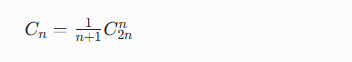
## 二、先验证你说的 3 个结点
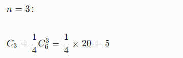  
和题目一致 ✅

## 三、算 4 个结点的二叉树种类
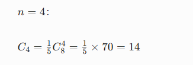

## 结论
**4 个结点的二叉树有 14 种**

## 软考必背前5个卡特兰数
- n=1：1 种
- n=2：2 种
- n=3：5 种
- n=4：**14 种**
- n=5：42 种

直接背下来，考场秒选。


## 为什么3个结点二叉树5种、4个结点14种？
不用公式，**用逻辑拆分讲原理**，超好懂。

## 1. 核心道理
一棵二叉树一定有：
**1个根结点 + 左子树若干结点 + 右子树若干结点**

设总结点数为 \(n\)：
根占1个，剩下 \(n-1\) 个分给**左、右子树**
左边k个，右边就 \((n-1-k)\) 个
把所有分配情况**加起来**，就是总形态数。

---

## 2. 先看 n=3（3个结点）
总3个：根1个，剩 2 个分给左右

分配只有3种分法：
1. 左0个，右2个
2. 左1个，右1个
3. 左2个，右0个

叠加每种的形态数量：
- 0个结点：**1种**（空树）
- 1个结点：**1种**
- 2个结点：**2种**

总数：
1×2+1×1+2×1=2+1+2=5  
所以 **3个结点 = 5种**，和题目一致。

---

## 3. 推导 n=4（4个结点）
4个结点：根1个，剩 3 个分给左右

分配四种情况：
1. 左0，右3
2. 左1，右2
3. 左2，右1
4. 左3，右0

已知：
- 0个：1
- 1个：1
- 2个：2
- 3个：5

总形态：
1×5+1×2+2×1+5×1=5+2+2+5=14

---

## 总结原因
二叉树形态数，本质是：
**固定根节点，把剩下结点拆分给左、右子树，左右形态数相乘，所有拆分相加**，这就是卡特兰数的底层逻辑。

记住：
1个→1
2个→2
3个→5
4个→**14**
软考直接背就行。

## 卡特兰数（二叉树形态数）完整推导过程
## 一、先定义
设：
\(f(n)\) = **n 个结点的不同形态二叉树个数**

## 二、递推关系怎么来
n 个结点二叉树：
1. 必须有 **1 个根节点**
2. 剩下 \(n-1\) 个结点，分给 **左子树、右子树**

设：
- 左子树有 \(k\) 个结点
- 那右子树就有 \((n-1-k)\) 个结点

k
可以取：
0,1,2,…,n−1

对每一种 \(k\)：
- 左子树形态：\(f(k)\)
- 右子树形态：\(f(n-1-k)\)
- 组合起来：**f(k)×f(n−1−k)**

把所有 \(k\) 情况加起来，得到**卡特兰递推公式**：  
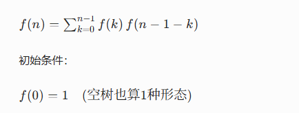

---

## 三、用递推公式手动算一遍
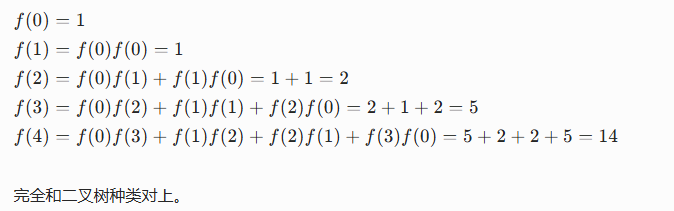

---

## 四、从递推公式推通项公式（组合数形式）

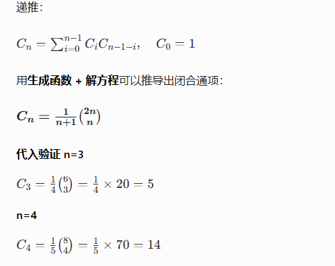

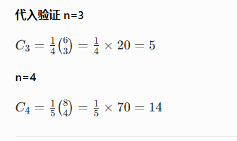
---

## 一句话总结推导逻辑
1. 固定根，剩余结点分给左右子树
2. 左右形态数相乘，所有分法累加 → 得到**递推式**
3. 数学上再由递推式推导出 **组合数通项公式**
4. 直接用公式就能秒算任意结点数的二叉树形态数量。

# 4. 大顶堆

## 1. 本质
大顶堆是一棵**完全二叉树**，同时满足一个硬性规则：
**所有父结点 ≥ 它的左、右孩子结点**

根结点是**整个堆里最大的数**。

## 2. 直观规则
- 每一个爸爸 **都比两个儿子大**
- 树根：全局最大值

小顶堆反过来：
**所有父结点 ≤ 孩子**，树根是最小值。

## 3. 存放在数组里的规则（下标从1开始）
下标 \(i\)：
- 左孩子：\(2i\)
- 右孩子：\(2i+1\)
  只要满足：  
  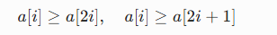  
  就是大顶堆。

## 4. 举个最简例子
```
      9
    7   8
   6 4 5
```
- 9≥7、9≥8
- 7≥6、7≥4
- 8≥5
  完全符合 → **大顶堆**

## 5. 软考必记
1. 大顶堆 = 完全二叉树 + **父≥子**
2. 根是最大值
3. 常用于：堆排序、优先队列

