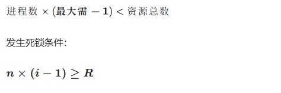
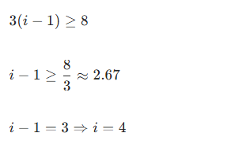

# 1. 进程死锁
互斥资源R 有8个， 3个进程， 竞争R，每个都需要i个 r ，则系统发生死锁的最少i值
## 死锁秒杀公式
## 核心公式

---
已知：
资源 \(R=8\)，进程数 \(n=3\)，每个进程需要 \(i\) 个资源

代入死锁条件：

---
## 验证
- \(i=3\)：每人拿2个
  \(3* 2 = 6 < 8\)，还剩资源，**不会死锁**
- \(i=4\)：每人拿3个
  \(3* 3 = 9 > 8\)，资源耗尽，全部等待，**发生死锁**

---
✅ **答案：发生死锁最少 \(i = 4\)**

---
### 万能口诀
每进程先给「需要数-1」
总和 ≥ 资源数 → 必死锁

用**死锁标准算法**，一步一步给你讲明白，超好懂。

已知：  
资源总数：**8 个**  
进程：3 个  
每个进程最多需要：**3 个**

---
## 第一步：死锁最坏分配（最容易卡死的情况）
要卡死：每个进程都**差1个**就满足  
每个进程先拿：3-1=2 个

3个进程一共占用：3 *2 = 6

剩余资源：8 - 6 = 2 个

---
## 第二步：判断会不会死锁
还剩 **2个空闲资源**  
随便分给任意一个进程，它就能凑够 3 个 → 正常运行、释放资源  
资源一释放，其他进程陆续都能运行

✅ **所以：不会死锁**

---
## 对比：i=4 就会死锁
每个进程需要 4 个  
最坏每人拿：4-1= 3 个  
3 * 3 = 9 > 8  
资源根本不够分，所有人都卡在「差1个」，**死死锁住**。