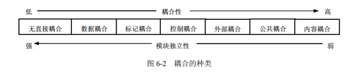
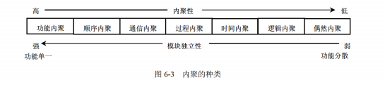

# 1. 敏捷开发

## 一、敏捷开发定义
**敏捷开发**：以**用户需求**为核心，**迭代、增量、小步快跑**的轻量级开发方法，快速交付、持续反馈、灵活变更。

---
## 二、敏捷4大核心价值观（必考）
1. **个体与互动** ＞ 流程与工具
2. **可用的软件** ＞ 详尽的文档
3. **客户协作** ＞ 合同谈判
4. **响应变化** ＞ 遵循计划

---
## 三、敏捷常用模型（高频）
1. **Scrum**（最常考）
- 角色：产品负责人PO、Scrum Master、开发团队
- 周期：冲刺（Sprint，短周期迭代）
- 会议：每日站会、冲刺规划、评审、回顾会

2. **XP 极限编程**
- 核心：结对编程、测试先行、持续集成、频繁发布、简单设计

3. **看板/Kanban**
- 可视化流程、限制在制品、持续流动

4. **水晶方法**：轻量、以人为本

---
## 四、敏捷特点（选择题秒杀）
1. 迭代开发、增量交付
2. 欢迎需求变更（后期也可改）
3. 短周期、小版本、快速上线
4. 强调团队协作、面对面沟通
5. 弱化冗余文档，重视可用软件

---
## 五、对比：瀑布 vs 敏捷
- **瀑布**：阶段划分明确、文档多、变更困难、顺序执行、适合需求固定
- **敏捷**：迭代循环、文档少、拥抱变更、适合需求多变

---
## 六、一句话速记
敏捷：**迭代增量、拥抱变化、重视人、少文档、快交付、客户持续协作**。


# 2. 模块独立 耦合 内聚
## 耦合
耦合是模块之间的相对独立性（互相连接的紧密程度）的度量。耦合取决于各个模块之间接口的复杂程度、调用模块的方式以及通过接口的信息类型等。一般模块之间可能的耦合方式有7种类型，如图6-2所示。

图6-2 耦合的种类（从左到右耦合性由低到高、模块独立性由强到弱：无直接耦合、数据耦合、标记耦合、控制耦合、外部耦合、公共耦合、内容耦合）

- 无直接耦合。指两个模块之间没有直接的关系，它们分别从属于不同模块的控制与调用，它们之间不传递任何信息。因此，模块间耦合性最弱，模块独立性最高。
- 数据耦合。指两个模块之间有调用关系，传递的是简单的数据值，相当于高级语言中的值传递。
- 标记耦合。指两个模块之间传递的是数据结构。
- 控制耦合。指一个模块调用另一个模块时，传递的是控制变量，被调用模块通过该控制变量的值有选择地执行模块内的某一功能。因此，被调用模块应具有多个功能，哪个功能起作用受调用模块控制。
- 外部耦合。模块间通过软件之外的环境联结（如I/O将模块耦合到特定的设备、格式、通信协议上）时称为外部耦合。
- 公共耦合。指通过一个公共数据环境相互作用的那些模块间的耦合。
- 内容耦合。当一个模块直接使用另一个模块的内部数据，或通过非正常入口转入另一个模块内部时，这种模块之间的耦合称为内容耦合。


---

### 1. 无直接耦合
**定义**：两个模块完全没关系，不互相调用、不传递任何信息。
**例子**：
- 模块A：用户登录模块
- 模块B：商品库存模块
- 两个模块之间不互相调用，也不直接传递任何数据，通过其他中间模块间接协作。

---

### 2. 数据耦合
**定义**：模块间调用时，只传递简单的数值/字符串等基础数据。
**例子**：
- 模块A：计算圆面积
  ```java
  double calcCircleArea(double radius) {
      return 3.14 * radius * radius;
  }
  ```
- 模块B：调用A，只传半径这个数值：
  ```java
  double area = calcCircleArea(5.0);
  ```
只传了`5.0`这个简单数值，没有复杂结构或控制逻辑。

---

### 3. 标记耦合
**定义**：模块间传递的是**数据结构/对象/结构体**。
**例子**：
- 定义数据结构：
  ```java
  class Student {
      String name;
      int age;
      double score;
  }
  ```
- 模块A：打印学生信息
  ```java
  void printStudent(Student s) {
      System.out.println(s.name + "：" + s.score);
  }
  ```
- 模块B：调用A，传递整个Student对象：
  ```java
  Student stu = new Student("小明", 18, 90);
  printStudent(stu);
  ```
传递的是`Student`这个数据结构，而不是零散的字段值。

---

### 4. 控制耦合
**定义**：传递控制变量，被调用模块根据变量的值执行不同分支。
**例子**：
- 模块A：根据标志位执行不同操作
  ```java
  void doAction(int flag) {
      if (flag == 1) {
          System.out.println("新增用户");
      } else if (flag == 2) {
          System.out.println("删除用户");
      }
  }
  ```
- 模块B：调用A，传递控制变量`flag`：
  ```java
  doAction(2); // 控制A执行“删除用户”分支
  ```
模块B通过`flag`控制了模块A的执行流程。

---

### 5. 外部耦合
**定义**：模块间通过软件外部的环境/设备/协议耦合。
**例子**：
- 模块A：读写串口数据，和串口硬件绑定
- 模块B：通过串口和A通信，依赖串口的波特率、数据格式
- 两个模块都依赖“串口设备”这个外部环境，一旦串口配置变化，两个模块都会受影响。

---

### 6. 公共耦合
**定义**：多个模块共享同一个公共数据区（全局变量、公共数据库表等）。
**例子**：
- 全局变量：`public static int totalCount = 0;`
- 模块A：下单模块，执行`totalCount += 1;`
- 模块B：统计模块，读取`totalCount`的值
- 两个模块都直接读写同一个全局变量，任何一个模块修改了值，都会影响另一个模块的结果。

---

### 7. 内容耦合（最差耦合）
**定义**：一个模块直接访问/修改另一个模块的内部数据，或直接跳转到对方内部代码。
**例子**：
```java
class ModuleA {
    private int count = 0; // 内部私有变量
}

class ModuleB {
    void hackA(ModuleA a) {
        // 直接修改A的私有变量（违反封装）
        a.count = 100;
        // 或者直接跳转到A的内部方法执行（非正常入口）
    }
}
```
模块B直接操作了模块A的内部私有数据，完全破坏了模块的独立性，耦合度最高。

---

### 一句话秒杀区分
| 耦合类型 | 核心判断点 |
| :--- | :--- |
| 无直接耦合 | 完全没关系，不调用不通信 |
| 数据耦合 | 只传简单数值 |
| 标记耦合 | 传递数据结构/对象 |
| 控制耦合 | 传标志位，控制对方分支 |
| 外部耦合 | 依赖外部设备/协议 |
| 公共耦合 | 共享全局数据/公共变量 |
| 内容耦合 | 直接读写对方内部数据 |


---

## 内聚
内聚是对一个模块内部各个元素彼此结合的紧密程度的度量。一个内聚程度高的模块（在理想情况下）应当只做一件事。一般模块的内聚性分为7种类型，如图6-3所示。

图6-3 内聚的种类（从左到右内聚性由高到低、模块独立性由强到弱：功能内聚、顺序内聚、通信内聚、过程内聚、时间内聚、逻辑内聚、偶然内聚）

- 偶然内聚（巧合内聚）。指一个模块内的各处理元素之间没有任何联系。
- 逻辑内聚。指模块内执行若干个逻辑上相似的功能，通过参数确定该模块完成哪一个功能。
- 时间内聚。把需要同时执行的动作组合在一起形成的模块称为时间内聚模块。
- 过程内聚。指一个模块完成多个任务，这些任务必须按指定的过程执行。
- 通信内聚。指模块内的所有处理元素都在同一个数据结构上操作，或者各处理使用相同的输入数据或者产生相同的输出数据。
- 顺序内聚。指一个模块中的各个处理元素都密切相关于同一功能且必须顺序执行，前一功能元素的输出就是下一功能元素的输入。
- 功能内聚。这是最强的内聚，指模块内的所有元素共同作用完成一个功能，缺一不可。

耦合性和内聚性是模块独立性的两个定性标准，在将软件系统划分模块时，应尽量做到高内聚、低耦合，提高模块的独立性。
### 1. 偶然内聚（最弱）
**定义**：模块内语句、代码**毫无关系**，强行凑在一块。
**例子**：
一个模块里：清空日志、计算工资、播放背景音乐。
三件事完全不搭边，只是随便写到同一个模块里。

---

### 2. 逻辑内聚
**定义**：逻辑上是一类事，**靠参数选择执行哪个功能**。
**例子**：
「员工操作模块」
传入参数：1=新增员工、2=删除员工、3=查询员工
一堆相似功能放一起，靠标志位选功能。

---

### 3. 时间内聚
**定义**：**同一时间段、同一时刻**要一起执行的操作放一起。
**例子**：
系统**开机初始化模块**：
加载配置、清空缓存、初始化日志、连接数据库。
不是功能相关，只是「要一起同时做」。

---

### 4. 过程内聚
**定义**：多个任务，**必须按固定先后步骤执行**，但彼此无关、不共用数据。
**例子**：
订单流程模块：
1. 校验手机号 → 2. 打印小票 → 3. 弹窗提示
   只是按顺序做步骤，上一步结果**不给**下一步用。

---

### 5. 通信内聚（高频考题）
**定义**：所有操作**操作同一个数据 / 同一个数据结构**。
**例子**：
学生信息模块：
读取学生结构体 → 修改成绩 → 保存学生结构体
所有功能，都围着**同一个学生数据**干活。


---

### 6. 顺序内聚
**定义**：顺序执行，**上一步的输出 = 下一步的输入**，紧密相连。
**例子**：
文件处理模块：
1. 读取文件内容（输出文本）
2. 文本加密（用上一步的文本）
3. 保存加密文件
   一环扣一环，数据流连续传递。

---

### 7. 功能内聚（最强、最优）
**定义**：模块所有代码，**只为完成唯一一件完整功能，缺一不可**。
**例子**：
「纯密码加密模块」
所有代码只干一件事：输入明文、输出密文。
删掉任意一段，功能就废了。

---

## 内聚强弱排序（必背 弱→强）
偶然 ＜ 逻辑 ＜ 时间 ＜ 过程 ＜ 通信 ＜ 顺序 ＜ 功能

## 秒杀口诀
1. 乱七八糟随便凑 → 偶然
2. 一类功能靠参数选 → 逻辑
3. 同一时间一起跑 → 时间
4. 固定步骤不传数据 → 过程
5. 共用同一个数据 → 通信
6. 前一步结果给后一步 → 顺序
7. 只干一件完整事 → 功能

# 3。 软件过程模型

---

## 1. 瀑布模型
### 核心特点
- **线性、顺序执行**：需求分析 → 设计 → 编码 → 测试 → 维护，每个阶段必须做完才进入下一个。
- 阶段间有明确的文档和评审。

### 适用场景
- 需求**非常明确、稳定**，几乎不会变更的项目（比如政府、军工项目）。

### 优缺点
✅ 优点：流程清晰、文档齐全、便于管理  
❌ 缺点：不灵活，后期修改成本极高；用户要到最后才能看到产品，风险集中在后期。

---

## 2. 增量模型
### 核心特点
- 把系统拆成多个**增量模块**，先做核心功能，再逐步扩展。
- 每完成一个增量，就交付给用户使用、反馈，再做下一个。

### 适用场景
- 需求不明确、希望**快速交付核心功能**、用户可以参与迭代反馈的项目。

### 优缺点
✅ 优点：可早期交付、降低整体风险、便于调整需求  
❌ 缺点：需要良好的架构设计，否则后期模块集成困难。

---

## 3. 原型模型（演化模型的一种）
### 核心特点
- 先快速搭建一个**可运行的原型**（界面+核心流程），让用户直观感受、确认需求。
- 根据用户反馈修改原型，最终演化成正式系统。

### 适用场景
- 需求**模糊、用户说不清**的项目（比如新型业务、创新产品）。

### 优缺点
✅ 优点：能快速澄清需求，避免后期返工  
❌ 缺点：原型可能被当成正式系统，导致开发人员过度修改；容易陷入“为原型而原型”的循环。

---

## 4. 螺旋模型（演化模型的一种）
### 核心特点
- 把瀑布模型和原型模型结合，加入**风险分析**环节，像螺旋一样迭代上升。
- 每个迭代周期包含：制定计划 → 风险分析 → 开发与验证 → 客户评估。

### 适用场景
- 大型、复杂、风险高的项目（比如航天、金融系统）。

### 优缺点
✅ 优点：强调风险控制，每个阶段都评估风险，适合高风险项目  
❌ 缺点：迭代周期长、成本高，需要专业的风险评估能力。

---

## 5. 喷泉模型
### 核心特点
- 以**用户需求为驱动**，支持开发过程的**迭代和无间隙**。
- 开发阶段（分析、设计、编码、测试）可以反复、交叉进行，像喷泉一样。

### 适用场景
- 面向对象开发的项目（因为OO本身就支持迭代和复用）。

### 优缺点
✅ 优点：支持复用、开发效率高，各阶段无明显界限  
❌ 缺点：过程不清晰，不利于管理和文档跟踪。

---

## 6. 基于构件的开发模型（CBD）
### 核心特点
- 利用已有的**软件构件（组件）**来组装系统，像搭积木一样。
- 先检索可用构件，再适配、组装，少量开发定制部分。

### 适用场景
- 有成熟构件库、可复用性高的大型系统（比如ERP、电商平台）。

### 优缺点
✅ 优点：开发速度快、成本低、可维护性强  
❌ 缺点：依赖高质量的构件库，构件间的兼容性可能有问题。

---

## 7. 形式化方法模型
### 核心特点
- 用**严格的数学方法**（形式化语言）来描述需求和系统，直接生成可验证的程序。
- 开发过程中用数学逻辑证明系统的正确性。

### 适用场景
- 对安全性、可靠性要求极高的项目（比如航空航天、核控制系统）。

### 优缺点
✅ 优点：能从根本上保证系统的正确性，几乎无逻辑错误  
❌ 缺点：开发成本极高、周期长，需要专业的形式化方法专家，不适合普通项目。

---

## 软考速记对比表
| 模型 | 核心关键词 | 适用场景 |
|------|------------|----------|
| 瀑布 | 线性、顺序、需求稳定 | 需求明确、稳定的项目 |
| 增量 | 分模块、逐步交付 | 需求不明确、需早期交付 |
| 原型 | 快速建原型、确认需求 | 需求模糊、用户说不清 |
| 螺旋 | 风险分析、迭代上升 | 大型、复杂、高风险项目 |
| 喷泉 | 迭代无间隙、面向对象 | OO开发、需求可反复调整 |
| 基于构件 | 复用构件、搭积木 | 有成熟构件库的大型系统 |
| 形式化 | 数学验证、高可靠 | 安全/可靠性要求极高的项目 |
