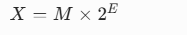
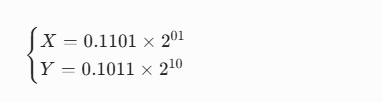
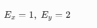
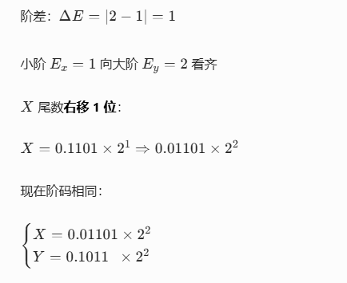
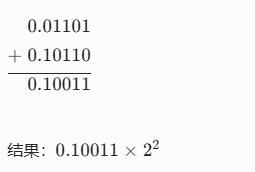
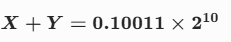
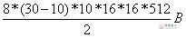
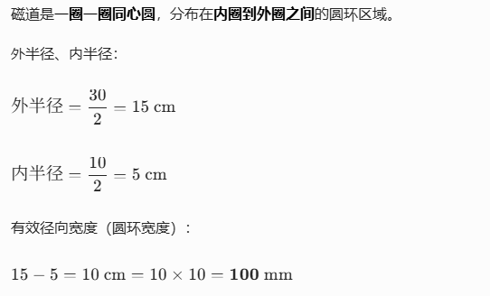
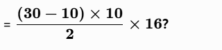
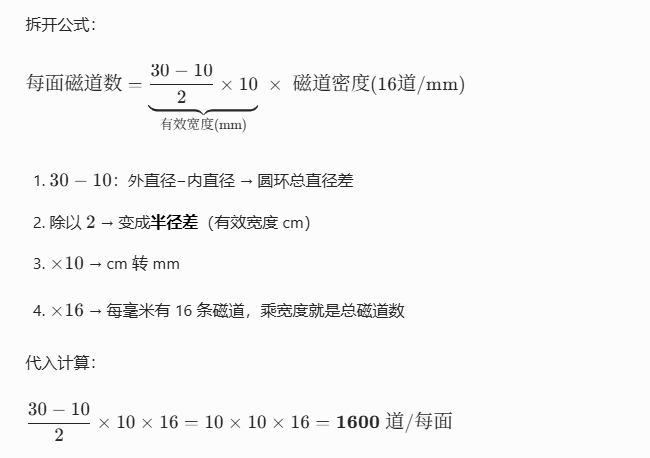

# 1.原码 反码 补码
---
## 一、基础规定
1. 最高位：**符号位**
- 正数：符号位 = \(0\)
- 负数：符号位 = \(1\)
2. 正数：**原码 = 反码 = 补码**（三个一模一样）
3. 只有**负数**，三者不一样（考试核心考点）

---
## 二、三者定义 & 换算公式
设：机器字长n位

### 1. 正数（\(X>0\)）
原码 = 反码 = 补码

### 2. 负数（\(X<0\)）
1. **原码**：符号位1，数值位直接写真值
2. **反码**：
   负数反码 = 符号位不变，数值位按位取反
3. **补码**（最重要！计算机存的都是补码）
   负数补码 = 反码 + 1

---
## 三、实操计算举例（8位）
### 例1：正数 +5
真值：\(+5 = 00000101\)
- 原码：00000101
- 反码：00000101
- 补码：00000101

---
### 例2：负数 -5
1. 原码：
   符号位1 + 5二进制
   10000101
2. 反码：符号不变，数值位取反
   11111010
3. 补码：反码
   11111011

---
## 四、特殊值 0（必考坑点）
8位：
1. 原码、反码：0 有两种表示
- 正0：\(00000000\)
- 负0：\(10000000\)
2. 补码：**0 只有一种**
00000000  
   👉 补码好处：没有负0，多存一个最小负数

---
##  五、8位范围（选择常考）
- 原码 / 反码：-127 ~ +127
- 补码：-128 ~ +127
  （多出来的 -128 就是利用负0编码位置）

---
## 六、最简秒杀口诀
1. 正数：三码相同
2. 负数：
- 原码：符号1，原样写
- 反码：符号不动，数字取反
- 补码：反码 \(+1\)
3. 计算机**运算、存储一律用补码**

# 2. 浮点数相加运算规则

浮点数加法运算规则
浮点数格式：

## 四步标准流程
### 第一步：对阶

2. **小阶向大阶看齐**
   阶码小的那个，**尾数右移**ΔE位，直到阶码相等。
> 原则：**只右移、不左移，小阶追大阶**

### 第二步：尾数相加
对阶完成后，两个**尾数直接做二进制加减**。

### 第三步：规格化
相加后尾数要变回**规格化浮点数**
- 二进制规格化：尾数满足 0.1xxxx⋯
1. **左规**：尾数太小（高位是0）→ 尾数左移，阶码减1
2. **右规**：尾数溢出（≥1）→ 尾数右移，阶码加1

### 第四步：舍入 + 判溢出
1. 右移丢掉的低位，做**舍入处理**（0舍1入常用）
2. 检查阶码是否超出范围，判断**溢出**

---

## 一句话口诀
**对阶→尾数加→规格化→舍入判溢出**
对阶：小阶右移追大阶；
规格化：左规缩尾数降阶，右规扩尾数升阶。

## 浮点数标准格式
浮点数：  

- \(M\)：尾数（纯小数，规格化：
  0.1xxxxx
  ）
- \(E\)：阶码

---

## 举例实操
设两个二进制浮点数：  
  
阶码用二进制，先转十进制：

## 第1步：对阶

## 第2步：尾数相加

## 第3步：规格化
二进制规格化要求：**尾数 0.1xxxx**
现在尾数 \(0.10011\) 已经符合，**不用左规、右规**。

## 第4步：舍入 & 溢出
本例尾数刚好5位，无多余位，不用舍入；
阶码在合法范围，无溢出。

---

## 最终结果

---

## 补充：什么是左规、右规
1. **右规**
   尾数 ≥ 1 （形如 1.0xxxx）
   → 尾数右移一位，阶码+1
2. **左规**
   尾数太小 形如 0.00xxxxx
   → 尾数左移，阶码-1，直到变成 0.1xxxx

# 3.磁盘容量的计算

硬盘容量分为非格式化容量和格式化容量两种，计算公式如下：
非格式化容量=面数×（磁道数/面）×内圆周长×最大位密度
格式化容量=面数×（磁道数/面）×（扇区数/道）×（字节数/扇区）

实例
假设某硬盘由5个盘片构成（共有8个记录面），盘面有效记录区域的外直径为30cm，内直径为10cm，记录位密度为250位/mm，磁道密度为16道/mm，每磁道分16个扇区，每扇区512字节，则该硬盘的格式化容量约为（ ）MB。  
题目中给出硬盘的面数为8，每面的磁道数为（30-10）×10÷2 ×16，每磁道扇区数为16，每扇区512字节，
因此其格式化容量为

每面的磁道数为（30-10）×10÷2 ×16  为啥是这样计算呢

先把**每一步拆碎讲懂**，你就明白为什么是这么算了。

---

## 第一步：先理已知条件
- 外直径：30 cm
- 内直径：10 cm
- 磁道密度：**16 道/mm**
- 一共 8 个记录面

### 先统一单位：cm 转 mm
1 cm=10 mm

---

## 第二步：求盘面「径向有效宽度」

有效径向宽度（圆环宽度）：
15−5=10 cm=10×10=100 mm

---

## 第三步：为什么磁道数 

---

## 第四步：顺便帮你算出 格式化容量（完整算一遍）

已知：
- 记录面：8 面
- 每面磁道：1600 道
- 每磁道 16 扇区
- 每扇区 512 B

