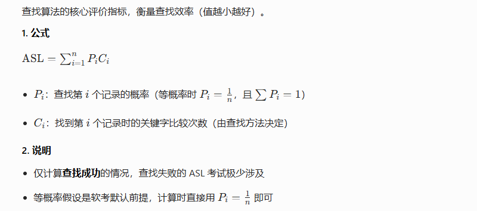
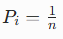
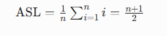
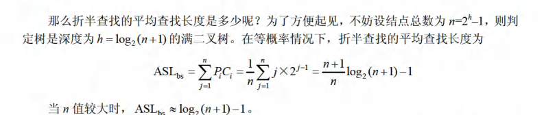
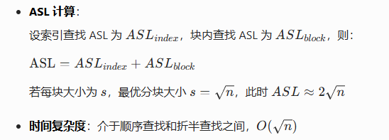
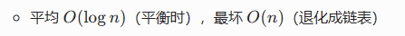
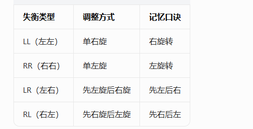

# 查找
按「基础概念→静态查找→动态查找→哈希查找」分类，覆盖所有高频考点，附公式、实例和考场技巧。

---

## 一、核心概念：平均查找长度（ASL）
查找算法的核心评价指标，衡量查找效率（值越小越好）。

### 1. 公式

### 2. 说明
- 仅计算**查找成功**的情况，查找失败的 ASL 考试极少涉及
- 等概率假设是软考默认前提，计算时直接用 即可

---

## 二、静态查找（表结构不修改，只查不改）
### 1. 顺序查找（线性查找）
- **原理**：从表头到表尾逐个比较，直到找到或遍历完
- **适用场景**：无序表/有序表均可
- **成功ASL（等概率）**：

- **时间复杂度**：平均 \(O(n)\)，最坏 \(O(n)\)
- **特点**：实现简单，效率低，适合小规模数据

### 2. 折半查找（二分查找，仅有序表可用）
- **原理**：每次取中间元素比较，根据大小决定去左半或右半继续查找
- **前提**：表必须**有序（升序/降序）**，且为顺序存储

### 3. 分块查找（索引顺序查找）
- **原理**：将表分成若干块，块内无序、块间有序，先查索引块确定目标所在块，再在块内顺序查找
- **结构**：主表 + 索引表（每块的最大关键字+块地址）

- **适用场景**：大规模、频繁增删的有序表

---

## 三、动态查找（表结构可增删，需维护有序）
### 1. 二叉排序树（BST，二叉查找树）
- **定义**：左子树所有结点关键字 < 根关键字，右子树所有结点关键字 > 根关键字，左右子树也都是BST
- **核心操作**：
    - 查找：从根出发，比根小去左子树，比根大去右子树，直到找到或为空
    - 插入：按查找逻辑定位到空结点，直接插入
    - 删除：
        1. 叶子结点：直接删除
        2. 单孩子结点：用孩子顶替
        3. 双孩子结点：用**中序前驱（左子树的最右结点）**或**中序后继（右子树的最左结点）**顶替，再删除该结点
- **ASL与时间复杂度**：
    
- **易错点**：删除双孩子结点的处理逻辑，中序遍历结果一定是升序序列

### 2. 平衡二叉树（AVL树）
- **定义**：每个结点的左右子树高度差（平衡因子）绝对值 ≤ 1，且左右子树都是AVL树
- **平衡因子**：左子树高度 - 右子树高度（取值：-1、0、1）
- **失衡调整**（必考4种情况）：  

- **核心目的**：避免BST退化成链表，保证查找效率稳定在O(logn)
- **考点**：给定插入序列，判断是否失衡、属于哪种类型、如何调整

### 3. B-树与B+树（多路平衡查找树）
#### B-树（m阶）
- **定义**：
    - 每个结点最多有 \(m\) 棵子树，关键字个数 \(k\) 满足：\(\lceil m/2 \rceil -1 \le k \le m-1\)（根结点除外，最少1个关键字）
    - 关键字按升序排列，且 \(k\) 个关键字对应 \(k+1\) 棵子树
    - 所有叶子结点在同一层
- **核心特点**：平衡的多路查找树，减少磁盘I/O次数（适合文件系统）
- **查找逻辑**：在结点内顺序/折半查找关键字，确定目标所在子树继续查找

#### B+树（软考高频）
- **与B-树的区别**：
    1. 所有关键字都出现在叶子结点中，非叶子结点仅起索引作用
    2. 叶子结点之间用指针连成有序链表，支持顺序查找
    3. 非叶子结点的关键字个数 = 对应子树个数（B-树是关键字个数=子树个数-1）
- **优势**：既支持随机查找（走索引），又支持顺序查找（遍历叶子链表），是数据库索引的主流结构
- **考点**：B+树的结构特点、与B-树的对比

---

## 四、哈希查找（散列查找）
### 1. 核心概念
- **哈希函数**：将关键字 \(k\) 映射为哈希地址 \(H(k)\)，公式：\(addr = H(k)\)
- **冲突**：不同关键字映射到同一哈希地址（软考必考）
- **装填因子**：\(\alpha = \frac{n}{m}\)（\(n\) 为关键字个数，\(m\) 为哈希表长度），α越大，冲突概率越高

### 2. 常用哈希函数
- **直接定址法**：\(H(k)=k\) 或 \(H(k)=a×k+b\)，无冲突，适合关键字连续的场景
- **除留余数法**（最常用）：\(H(k)=k \% p\)，其中 \(p\) 取小于等于 \(m\) 的质数，冲突概率最低
- **数字分析法**：取关键字中分布均匀的几位作为地址
- **平方取中法**：取关键字平方后的中间几位作为地址

### 3. 冲突处理方法（软考重点）
#### （1）开放定址法（闭散列）
- 原理：冲突时，按某种规则在哈希表中找下一个空地址
- 三种探测方式：
    1. **线性探测**：\(H_i(k)=(H(k)+i) \% m\)（\(i=0,1,2...\)），易产生「聚集」现象
    2. **二次探测**：\(H_i(k)=(H(k)±i^2) \% m\)，减少聚集
    3. **伪随机探测**：用随机数序列作为增量，避免聚集
- **ASL特点**：随装填因子α增大而急剧上升，α一般取0.7~0.8

#### （2）链地址法（开散列）
- 原理：将所有哈希地址相同的关键字存入同一链表中
- **结构**：哈希表的每个单元是一个链表头，冲突关键字直接挂在对应链表上
- **优势**：无聚集现象，适合频繁插入删除，ASL仅受装填因子α影响
- **ASL公式（等概率）**：
  \[
  \text{ASL}_{成功} \approx 1 + \frac{\alpha}{2}, \quad \text{ASL}_{失败} \approx \alpha + e^{-\alpha}
  \]

#### （3）再哈希法
- 冲突时使用另一个哈希函数计算新地址，直到找到空地址
- 缺点：计算量大，实现复杂

#### （4）建立公共溢出区
- 主表存无冲突关键字，溢出区存所有冲突关键字，冲突时去溢出区顺序查找
- 适合冲突较少的场景

### 4. 哈希查找的ASL计算
- 与装填因子α、冲突处理方法直接相关，与关键字个数n无直接关系
- 链地址法的ASL远优于开放定址法，是软考常考对比点

---

## 五、软考高频考点总结
| 查找方法 | 前提条件 | 时间复杂度 | 核心考点 |
|----------|----------|------------|----------|
| 顺序查找 | 无 | 平均O(n) | ASL计算 |
| 折半查找 | 有序、顺序存储 | O(logn) | 判定树、ASL计算 |
| 分块查找 | 分块有序 | O(√n) | 最优分块大小、ASL计算 |
| BST | 无 | 平均O(logn)，最坏O(n) | 删除双孩子结点、中序遍历 |
| AVL树 | BST+平衡 | O(logn) | 失衡类型判断、调整方式 |
| B+树 | 无 | O(logn) | 与B-树的区别、索引应用 |
| 哈希查找 | 无 | 平均O(1) | 冲突处理方法、ASL与α的关系 |

---

## 六、易错点提醒
1. 折半查找仅适用于**顺序存储的有序表**，链表有序表无法使用
2. AVL树的平衡因子是「左子树高度 - 右子树高度」，不是绝对值直接判断
3. 哈希查找的平均查找长度不是固定的，由装填因子和冲突处理方法决定
4. B+树的所有关键字都在叶子结点，非叶子结点仅起索引作用
