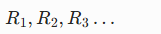
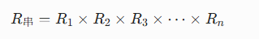
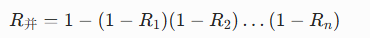
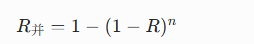
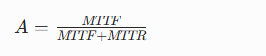

# 1. 四种白盒覆盖 
先排**严格程度从小到大**：
**语句覆盖 < 判定覆盖 < 条件覆盖 < 路径覆盖**

我用一段最简单代码举例，你立马懂：
```java
if(A>1 && B<3){
    System.out.println("走真分支");
}else{
    System.out.println("走假分支");
}
```
拆清楚：
- **2个条件**：
  条件1：`A>1`
  条件2：`B<3`
- **1个判定**：整个 `if` 最终结果（真 / 假）

---

## 1. 先搞懂四个定义极简版
### 语句覆盖（行覆盖）
只要**每一行代码跑一遍**就行。
随便给一组数据，把if真、else各走一次就完事，**不管内部条件**。

### 判定覆盖（分支覆盖）
只要求：
**if 结果为真 跑一次，if 结果为假 跑一次**
只看**最终分支**，不拆里面每个小条件。

### 条件覆盖
要求：
里面**每一个小条件 都要取一次真、一次假**
本例两个条件：
1. `A>1`：要真、要假
2. `B<3`：要真、要假

**只管每个条件单独真假，不管组合**。

### 路径覆盖
把**所有条件组合、所有执行路径 全部跑完**，最严格。

---

## 2. 举例：为什么「条件覆盖 > 判定覆盖」
### 判定覆盖只要求2条：
1. if整体 = 真
2. if整体 = 假

随便两组用例就能满足：
用例1：A=2,B=2 → A>1真，B<3真 → if整体真
用例2：A=0,B=5 → A>1假，B<3假 → if整体假

✅ 判定覆盖达标
❌ 但：
你看 **B<3 从来没单独假过、A>1也没单独搭配过真假**
很多条件情况没测到。

### 条件覆盖要求更细：
必须保证：
- A>1：真、假 都出现
- B<3：真、假 都出现

要凑齐4种条件状态，**用例比判定覆盖多、测的更细**
👉 所以：**条件覆盖 比 判定覆盖 严格、覆盖面更大**

---

## 3. 举例：为什么「路径覆盖 > 条件覆盖」
先看这个if里**所有条件组合**一共4种：

1. A>1 真，B<3 真
2. A>1 真，B<3 假
3. A>1 假，B<3 真
4. A>1 假，B<3 假

### 条件覆盖
只要求**每个条件自己有真有假**，
不要求**全部4种组合都走一遍**，可以少测几种组合。

### 路径覆盖
必须把**4种条件组合、所有执行路径全部跑满**
👉 路径覆盖要测的情况最多，比条件覆盖更全面、更严格。

---

## 4. 终极排序+一句话记忆
严格程度：
**语句覆盖 ＜ 判定覆盖 ＜ 条件覆盖 ＜ 路径覆盖**

- 语句：只管**每行跑一遍**
- 判定：只管**分支真假**
- 条件：管**每个小条件真假**
- 路径：管**所有条件组合、所有路径全覆盖**

---

## 5. 必背
1. **条件覆盖比判定覆盖严格**：因为判定只看最终分支，条件看内部每个小条件。
2. **路径覆盖最严格**：覆盖所有条件组合、所有执行路径。
3. 容易坑点：
   条件覆盖达标 **不代表** 判定覆盖一定达标；
   路径覆盖一定包含前面所有覆盖。

需要我给你整理这4种覆盖的**必背考题套路+典型选择题**吗？直接背就能秒做题。

# 2. 系统可靠度计算
先约定：
每个子系统**可靠度**：\(R\)  
多个相同模块：
故障相互独立

---

## 一、串联系统（一个坏全坏）
所有部件**全部正常**，系统才正常。
### 公式

### 理解
串在一起，**一个挂了整体挂**，可靠度越乘越小。

---

## 二、并联系统（一个好就能用）
只要**至少一个正常**，系统就正常。
先算**全部失效概率**，再用 1 减。

### 公式

### 相同模块并联（都为 \(R\)）


---

## 三、串并联混合（先串后并 / 先并后串）
拆开分层算：
1. 先把每一组**按串联算**
2. 再把各组结果**按并联算**

---

## 四、可靠度 & 可用度 别搞混（高频坑）
### 1. 可靠度（无故障运行概率）
就是上面 串联/并联 公式。

### 2. 可用度（常考 MTTR、MTTF）

- MTTF：平均无故障时间
- MTTR：平均修复时间

---

## 五、极简口诀
- **串联**：相乘，一个挂全挂
- **并联**：1 减 全失效乘积
- **可用度**：MTTF ÷ (MTTF+MTTR)

